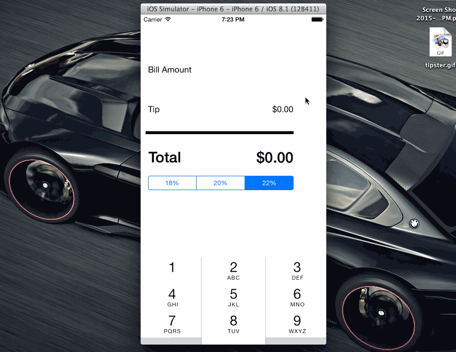

# tips
iOS tip calculator homework
codepath-tip-calculator
tip calculator iOS app (prework for iOS class)

Pre-work Tip Calculator for Codepath

This application is an exercise to complete the application to Codepath's iOS for Designers bootcamp. There is not a huge investment on design nor a lot of complex code behind it.

Time: I spent around 1.5 hours on the exercise itself, working alongside the tutorial video.

I went over the TreeHouse tutorials as far as I could before it blocked me, requiring an account.

I hope to spend time looking into some of the optional paerts of the tip calculator before the class starts, but I wanted to at least post this required portion.

What does the app can do?

Required: The user can calculate the tip, using diferent percentages, and click to close the keyboard.

